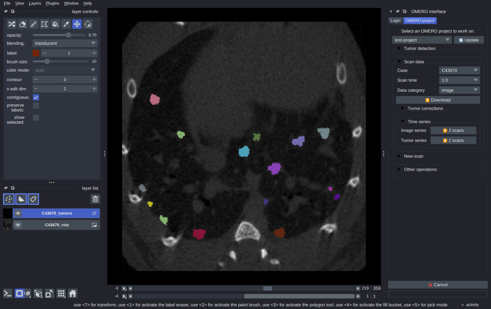

# OMERO-Mousetumorpy

> Image analysis of tumor nodules in mice CT scans

We provide a unified user interface in Napari to detect, track, visualize, annotate, and measure the size evolution of lung tumor nodules in mice CT scans. The datasets and experiment metadata are automatically downloaded and parsed from OMERO.

This project is part of a collaboration between the [EPFL Center for Imaging](https://imaging.epfl.ch/) and the [De Palma Lab](https://www.epfl.ch/labs/depalma-lab/).

## Installation

**As a standalone app**

Download and run the latest installer from the [Releases](https://github.com/EPFL-Center-for-Imaging/depalma-napari-omero/releases) page.

**In Python**

We recommend performing the installation in a clean Python environment. First, install the `zeroc-ice` package via the pre-built wheels from Glencoe Software. Choose the wheel corresponding to your python version (3.10, 3.11, 3.12) and platform (Windows, MacOS, Linux).

- Windows: https://github.com/glencoesoftware/zeroc-ice-py-win-x86_64/releases/
- MacOS: https://github.com/glencoesoftware/zeroc-ice-py-macos-universal2/releases/
- Linux: https://github.com/glencoesoftware/zeroc-ice-py-linux-x86_64/releases

Then, install our package from PyPi:

```sh
pip install depalma-napari-omero
```

or from the repository:

```sh
pip install git+https://github.com/EPFL-Center-for-Imaging/depalma-napari-omero.git
```

or clone the repository and install with:

```sh
git clone git+https://github.com/EPFL-Center-for-Imaging/depalma-napari-omero.git
cd depalma-napari-omero
pip install -e .
```

## Usage

**In Napari**

From the command-line, start Napari with the `depalma-napari-omero` plugin:

```
napari -w depalma-napari-omero
```

Refer to the [documentation](https://github.com/EPFL-Center-for-Imaging/depalma-napari-omero/wiki) for more details.

**As a CLI**

In interactive mode:

```
dno interactive
```

To run all workflows on a given project ID:

```
dno run <project_id> --tumor-model oct24
```

Refer to the [documentation](https://github.com/EPFL-Center-for-Imaging/depalma-napari-omero/wiki/CLI) for more details.

## License

This project is licensed under the [AGPL-3](LICENSE) license.

This project depends on the [ultralytics](https://github.com/ultralytics/ultralytics) package which is licensed under AGPL-3.

This project uses the [PyApp](https://github.com/ofek/pyapp) software for creating a runtime installer.

## Related projects

- [Mousetumorpy]()
- [Napari-mousetumorpy]()